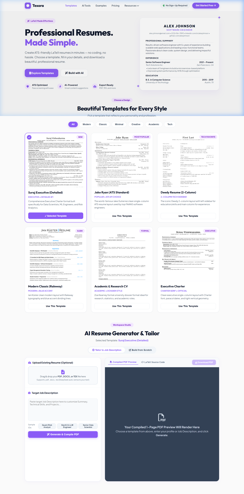

# 📄 Texora — Professional Resumes. Made Simple.

[](https://resume-builder-g31x.onrender.com/)
[](https://fastapi.tiangolo.com/)
[](https://openrouter.ai/)
[](https://www.latex-project.org/)
[](https://www.docker.com/)

**Texora** is a full-stack, AI-powered LaTeX resume studio built to create, tailor, and compile ATS-optimized 1-page resumes in seconds. Choose from curated professional LaTeX templates, upload an existing resume (`.pdf`, `.docx`, `.tex`), or paste a target Job Description to automatically generate tailored executive resumes.

👉 **[Experience the Live Web App on Render](https://resume-builder-g31x.onrender.com/)**

---

## 📸 App Interface Preview



---

## ✨ Key Features

- **📄 6 Curated Professional LaTeX Templates**:
  - **Suraj Executive (Detailed)**: Comprehensive Executive Charter layout built specifically for Data Scientists, ML Engineers, and Risk Analytics.
  - **Jake Ryan (ATS Standard)**: The world-famous single-column ATS layout used by FAANG software engineers.
  - **Deedy Resume (2-Column)**: Iconic 2-column tech layout with a left sidebar for skills & education.
  - **Modern Classic (Raleway)**: Jan Küster clean layout with Raleway typography and blue accent dividing lines.
  - **Academic & Research CV**: Zoe Kearney formal dossier format ideal for research, statistics, and academia.
  - **Executive Charter**: Clean single-column Charter font layout.

- **🤖 DeepSeek V3 AI Parsing & Tailoring**:
  - **Resume Parsing**: Drag & drop any `.pdf`, `.docx`, or `.tex` file; DeepSeek extracts and structures your profile details into JSON.
  - **Smart Tailoring**: Paste any target Job Description (JD); DeepSeek fine-tunes your Summary, Technical Skills, and generates high-impact target projects matching the JD.

- **🛠️ Dual-Mode Studio**:
  - **Mode 1 (Tailor Resume)**: Upload your file or select sample JDs to generate a tailored 1-page PDF.
  - **Mode 2 (Build from Scratch)**: Interactive multi-tab profile builder for users without an existing resume file.

- **🖥️ Live Side-by-Side Workspace**:
  - Real-time PDF preview iframe rendered directly from pdfTeX compilation alongside full LaTeX source code editing.

- **🔒 Privacy & Security First**:
  - Zero hardcoded secret keys. Auto-detects `OPENROUTER_API_KEY` from environment variables or `.env`.

---

## 🛠️ Tech Stack & Architecture

- **Backend**: FastAPI (Python 3.11), Uvicorn, Pydantic, Requests.
- **Text Extraction**: `pdfplumber`, `python-docx`.
- **LaTeX Compiler**: pdfTeX / MiKTeX / TeX Live.
- **AI Model Integration**: OpenRouter API (`deepseek/deepseek-chat`).
- **Frontend**: HTML5, Vanilla CSS3 (Texora purple design system), JavaScript.
- **Deployment**: Docker container on Render (`https://resume-builder-g31x.onrender.com/`).

---

## 🚀 Quickstart Guide (Local Development)

### 1. Clone the Repository
```bash
git clone https://github.com/Suraj6769/Resume_builder.git
cd Resume_builder
```

### 2. Install Python Dependencies
```bash
pip install -r requirements.txt
```

### 3. Ensure a Local LaTeX Engine is Installed
Make sure **MiKTeX** or **TeX Live** is installed on your system (`pdflatex` on PATH).

### 4. Configure Environment Variables
Create a local `.env` file in the root directory:
```env
OPENROUTER_API_KEY=your_openrouter_api_key_here
```

### 5. Launch the Application Server
```bash
python app.py
```
Open **[http://localhost:8050](http://localhost:8050)** in your browser!

---

## 🌐 Deploying to Render via Docker

1. Log in to **[Render Dashboard](https://dashboard.render.com)**.
2. Create a **New Web Service** and connect repository `Suraj6769/Resume_builder`.
3. Select **Language / Environment**: **`Docker`**.
4. Set Environment Variable:
   - `OPENROUTER_API_KEY`: `your_openrouter_api_key`
5. Render will automatically build the container (installing Python + TeX Live) and launch your live URL!

Live App: **[https://resume-builder-g31x.onrender.com/](https://resume-builder-g31x.onrender.com/)**

---

## 📄 License

Distributed under the MIT License. Built with ❤️ for Data Scientists, Engineers, and Job Seekers.
